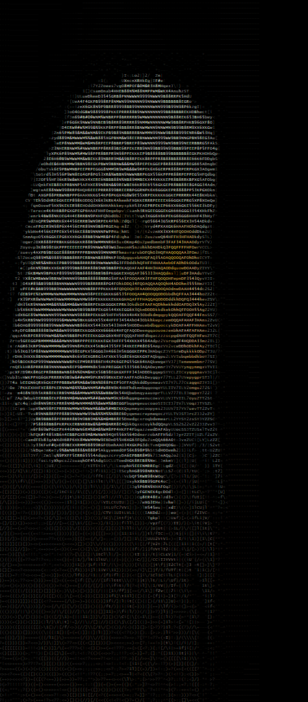
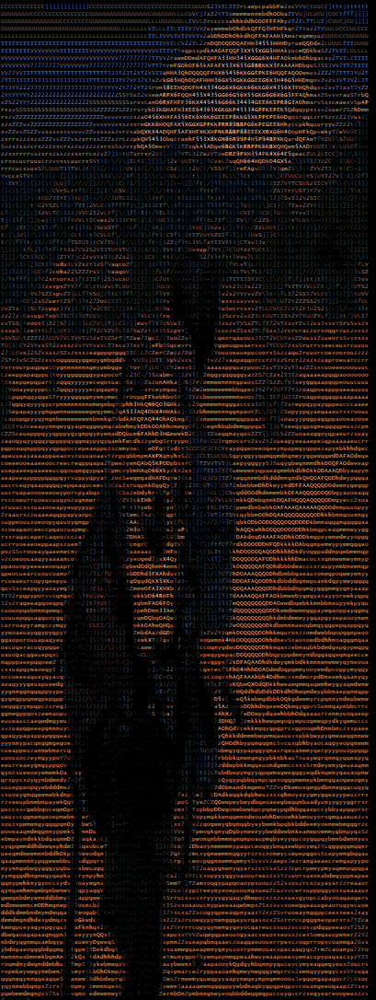
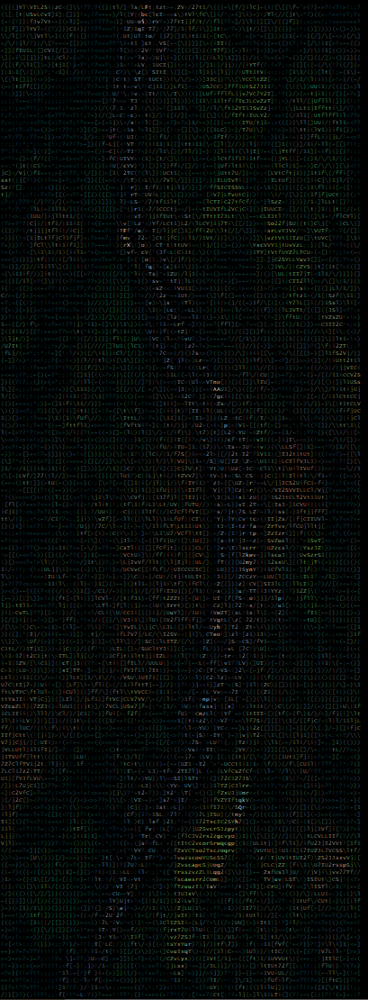

# Colored-Ascii-Art-Generator
This program converts images into colored ASCII art using various fonts. It displays the ASCII art directly in the console and saves it as a PNG image, using a specified font for styling.

## Overview
The table below showcases a comparison between the original image, the generated ASCII image output, and the console-rendered ASCII output:

| Original         | Image Output       | Console Output       |
|---------------|----------------------|----------------------|
| <div align="center"> <br/> Photo by [Pixabay](https://www.pexels.com/photo/black-and-white-eagle-36846/) </div> | <div align="center">  <br/> `Honk-Regular-VariableFont_MORF,SHLN.ttf` </div> | <div align="center">   <br/> `--print`  </div>  |
| <div align="center">  <br/> Photo by [Spencer Gurley Films](https://www.pexels.com/photo/man-with-blue-and-maroon-camping-bag-1448055/) </div>| <div align="center">  <br/> `BungeeTint-Regular.ttf` </div>| <div align="center">  <br/> `--print` </div>  |
| <div align="center">  <br/> Photo by [Deva Darshan](https://www.pexels.com/photo/aerial-view-of-road-in-the-middle-of-trees-1173777/) </div>| <div align="center">  <br/> `Nabla-Regular-VariableFont_EDPT,EHLT.ttf` </div> | <div align="center">   <br/> `--print`  </div>  |

                                
## Usage
Follow the steps below to set up and run the program:

### 1. Clone the Repository
Start by cloning the repository and navigating to the project directory:
```bash
git clone https://github.com/woodsj1206/Colored-Ascii-Art-Generator.git
cd Colored-Ascii-Art-Generator
```

### 2. Create and Activate a Virtual Environment
Set up a Python virtual environment to manage the project dependencies:
```bash
python -m venv myvenv
source myvenv/Scripts/activate
```

### 3. Install Dependencies
Install all required Python packages using the provided requirements.txt:
```bash
pip install -r requirements.txt
```

### 4. Run the Script
Follow the example below to execute the main script to print the ASCII output and save it as an image:
```bash
python main.py --print --image "images/image_name.jpg" --font "fonts/font_name.ttf" --font-size 12 --width-spacing 0 --height-spacing 0 --bg-color 0,0,0
```

### 5. Access the Generated Image
Once the script finishes running, the generated image will be saved in the `output_files` directory:
- Generated Image: `output_files/image_name_output.png`


## Project Structure
The following shows the main file structure of the project with brief descriptions:
```
├── fonts/                     # Folder containing font files
├── images/                    # Folder containing input images
├── output_files/              # Folder where the generated ASCII images are saved
├── main.py                    # Main script for generating ASCII art
├── progress_bar.py            # Progress bar implementation to visualize script execution
└── requirements.txt           # List of required Python packages for the project
```

## Acknowledgements
This project uses the following external resources:

### Fonts:
The following fonts are used in this project:
- [Honk](https://fonts.google.com/specimen/Honk) - Designed by Ek Type
- [Bungee Tint](https://fonts.google.com/specimen/Bungee+Tint) - Designed by David Jonathan Ross
- [Nabla](https://fonts.google.com/specimen/Nabla) - Designed by Arthur Reinders Folmer, Just van Rossum
> [!NOTE]
> Additional fonts can be added from [Google Fonts](https://fonts.google.com/).

### Images:
- Stock images sourced from [Pexels](https://www.pexels.com/).


## Development Environment
Tools and technologies used in the development of the project:
- IDE: Microsoft Visual Studio Community 2022 
- Language: Python 3.9
